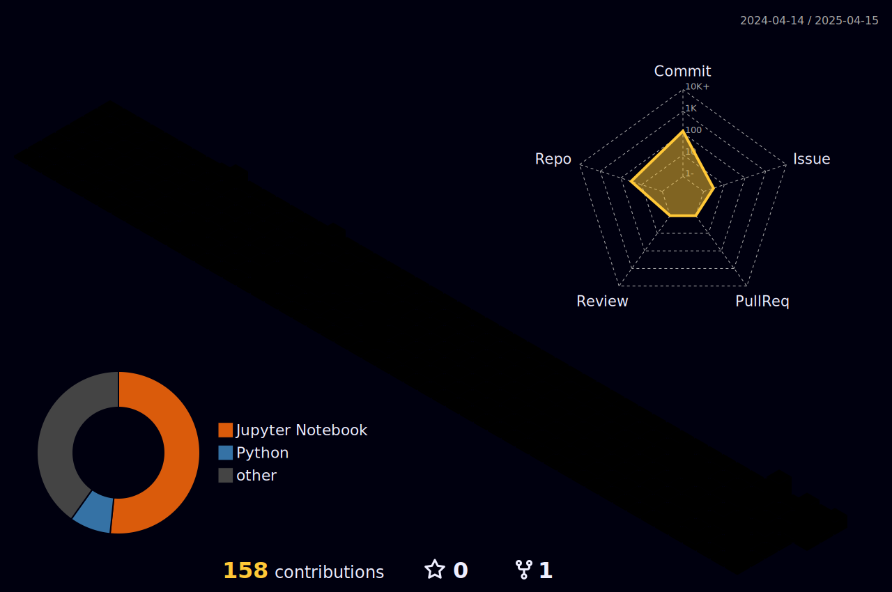

<!--
## Hi there 👋
-->

<h2> Hi! there</a>  </h2>

<!--
**IamRam3/IamRam3** is a ✨ _special_ ✨ repository because its `README.md` (this file) appears on your GitHub profile.

Here are some ideas to get you started:

- 🔭 I’m currently working on ...
- 🌱 I’m currently learning ...
- 👯 I’m looking to collaborate on ...
- 🤔 I’m looking for help with ...
- 💬 Ask me about ...
- 📫 How to reach me: ...
- 😄 Pronouns: ...
- ⚡ Fun fact: ...
-->

Hey, you! Yeah, you—caught you lurking on my page! 👀
I see the numbers climbing! 🧑‍💻 </br>
No pressure though—if you think I’m cool enough, don’t be shy... hit me up! 🔥 [](https://github.com/IamRam3)

<!--# <div align="center" style="font-size: 36px;"><h1> Hey 👋 <a  href="https://github.com/IamRam3/">Ram Dhavileswarapau </a> </h1> </div>-->

<h1 align="center">
  <b>Hey </b>
  
  <b> I'm <a href="https://github.com/IamRam3" style="color: #0366d6;">Ram Dhavileswarapu</a></b>
</h1>

<a href="https://www.linkedin.com/in/ram-dhavileswarapu-4ab502250/" title="LinkedIn">
  
</a>
<a href="mailto:sairam68386@gmail.com" title="Send Email">
  
</a>
<a href="https://www.reddit.com/user/FewSwitch6185/" title="Reddit">
  
</a>
<a href="https://ramdhavileswarapu.netlify.app/home" title="Portfolio"> 
  
</a>

 <a href="https://github.com/DenverCoder1/readme-typing-svg"></a>

<!--
  <a href="mailto:sairam68386@gmail.com"></a>
  <a href="https://www.linkedin.com/in/ram-dhavileswarapu-4ab502250/"></a>
  <a href="https://ramdhavileswarapu.netlify.app/">
  
</a>
-->
</p>

<div align="center">
  
</div>

<p align="center">
  <a href="https://github.com/OldCodersClub/faq">
  
</a>

<a href="https://github.com/IamRam3?tab=repositories&q=&type=&language=&sort=stargazers">
  
</a>

## <picture></picture> <span style="font-size: 30px;">About ME </span> 


<!--<span style="font-size: 18px;">-->
I'm an **`engineer`** with a deep love for coding, math, and physics. I'm passionate about **`crafting intelligent systems`** that solve real-world problems. From autonomous robotics to scalable web apps & exploring reinforcement learning, or pushing performance limits in computer vision and HPC—I thrive on **`solving complex problems that matter`** & at the **`intersection of software and hardware`**, where the boundaries between the two start to blur. I'm a strong believer in **`open source`**, **`continuous learning`**, and using tech to create real-world impact. Let's collaborate, innovate, and bring ideas to life! 🤖⚡
<!--</span>-->


- 🌱 **Exploring:** , , ,  and . 
- 💼 **Open for:** , Research-Driven Development &  or .
- 💬 **Let's talk about:** , , , ,  and  or any cutting-edge tech
- ♟️ **Hobbies:** Chess, Cricket, Long Runs, and diving into anything new and exciting in tech or life


__View my resume__ 
<a href="https://github.com/IamRam3/side-projects/blob/main/resume/ram_cv.pdf">here.</a>


<h2> Skills & Tools : </h2>

<p align="center"> 
<div align="left">
  <kbd> <kbd> DataBases </kbd> <br><br>
  
  
  
  
    </kbd>
  <kbd> <kbd> Languages </kbd> <br><br>
  
  
  
  
  
  
  </kbd>
  <kbd> <kbd> Frameworks </kbd> <br><br>
  
  
  
  
  
  
  
  
  
  
  
  
  
  
  </kbd>

  
  <!-- Custom icons -->

  <kbd> <kbd> Tools </kbd> <br><br>
  
  
  
  
  
  
  
  
  
  </kbd>

<!--
  <code><a href = "https://www.adobe.com/in/products/illustrator.html"></a></code>
-->


</div>


<br>

<h2> 
  <!---->
  <!---->
   GitHub Stats:</h2>


<table> 
  <tr>
    <td></td>
    <td></td>
   </tr>
</table>
<table>
  <tr>
    <p align="center">
      
      
<!--        -->
     
    </p>
  </tr>
</table>


<p align="center">
  
</p>


<details>
  <summary>
    
    <strong>&nbsp;&nbsp;&nbsp;&nbsp;Exploring Myself</strong>
  </summary>

  <br>

<!--START_SECTION:waka-->


**🐱 My GitHub Data** 

> 📦 ? Used in GitHub's Storage 
 > 
> 🏆 212 Contributions in the Year 2025
 > 
> 🚫 Not Opted to Hire
 > 
> 📜 38 Public Repositories 
 > 
> 🔑 0 Private Repositories 
 > 
**I'm an Early 🐤** 

```text
🌞 Morning                48 commits          █████░░░░░░░░░░░░░░░░░░░░   20.43 % 
🌆 Daytime                92 commits          ██████████░░░░░░░░░░░░░░░   39.15 % 
🌃 Evening                77 commits          ████████░░░░░░░░░░░░░░░░░   32.77 % 
🌙 Night                  18 commits          ██░░░░░░░░░░░░░░░░░░░░░░░   07.66 % 
```
📅 **I'm Most Productive on Tuesday** 

```text
Monday                   21 commits          ██░░░░░░░░░░░░░░░░░░░░░░░   08.94 % 
Tuesday                  63 commits          ███████░░░░░░░░░░░░░░░░░░   26.81 % 
Wednesday                18 commits          ██░░░░░░░░░░░░░░░░░░░░░░░   07.66 % 
Thursday                 21 commits          ██░░░░░░░░░░░░░░░░░░░░░░░   08.94 % 
Friday                   29 commits          ███░░░░░░░░░░░░░░░░░░░░░░   12.34 % 
Saturday                 35 commits          ████░░░░░░░░░░░░░░░░░░░░░   14.89 % 
Sunday                   48 commits          █████░░░░░░░░░░░░░░░░░░░░   20.43 % 
```


📊 **This Week I Spent My Time On** 

```text
🕑︎ Time Zone: Asia/Kolkata

💬 Programming Languages: 
Python                   6 hrs 10 mins       ████████████████░░░░░░░░░   62.44 % 
JavaScript               1 hr 41 mins        ████░░░░░░░░░░░░░░░░░░░░░   17.06 % 
Text                     48 mins             ██░░░░░░░░░░░░░░░░░░░░░░░   08.16 % 
Markdown                 32 mins             █░░░░░░░░░░░░░░░░░░░░░░░░   05.51 % 
Docker                   16 mins             █░░░░░░░░░░░░░░░░░░░░░░░░   02.77 % 

🔥 Editors: 
VS Code                  9 hrs 52 mins       █████████████████████████   100.00 % 

💻 Operating System: 
Linux                    8 hrs 57 mins       ███████████████████████░░   90.68 % 
Windows                  55 mins             ██░░░░░░░░░░░░░░░░░░░░░░░   09.32 % 
```

**I Mostly Code in Python** 

```text
Python                   4 repos             ███████░░░░░░░░░░░░░░░░░░   26.67 % 
Jupyter Notebook         4 repos             ███████░░░░░░░░░░░░░░░░░░   26.67 % 
C++                      3 repos             █████░░░░░░░░░░░░░░░░░░░░   20.00 % 
JavaScript               2 repos             ███░░░░░░░░░░░░░░░░░░░░░░   13.33 % 
CMake                    1 repo              ██░░░░░░░░░░░░░░░░░░░░░░░   06.67 % 
```


 Last Updated on 14/05/2025 00:41:45 UTC
<!--END_SECTION:waka-->


  

</details>


 
<table> 
  <tr>
    <p align="center"></p>
   </tr>
</table>
<table> 
   
</div>
</table>


<!--
## 📊 GitHub Activity Graph

<a href="https://github.com/IamRam3">
  
</a>
-->

<!--- trophy (start) -->
<div align=center>
  <a href="https://github.com/IamRam3/github-profile-trophy" title="Go to Source">
      
    </a>
</div>
<!--- trophy (start) -->

 ----------

### 🧊 3D Contribution Graph



<!--
<p align="center">
    
  <h4 align="center"><code>📊 𝙶𝚒𝚝𝙷𝚞𝚋 𝙼𝚎𝚝𝚛𝚒𝚌𝚜</code></h4>
</p>
-->


##  Let's Connect!

> I'm always happy to collaborate on cool projects. Feel free to connect or contribute!


<hr>


```python
class Engineer(Ram):
   """self-taught developer that love to learn more about Technologies"""
   
   def __init__(self):
     
      self.name = "Ram"
      self.age = 24
      self.role = "Fresher"

      self.TOOLS = {
          "ScriptingLanguages" : ("Python"),
          "ProgrammingLanguages" : ("C++"),
          "Editors" : ("VsCode"),
          "Platform" : ("LINUX",),
          "OtherTools" : ()
         }

      self.INTERESTS = [
         "Computer Sciences",
         "Electrical & Electronic Engineering",
         ]

   def use(self, tool):
      """use one of my tools or use bunch of them."""
      return self.tools[tool]


   def work(self):
      """"""
      while not WORK_DONE:
         # keep work.
         self.use(tool)

      return WORK_DONE


   def __len__(self):
      """Fun Fact"""
      return 181 # cm


   def __repr__(self):
      """"""
      return f"{self.name} an {self.age} y.o self-taught developer and {self.role}"

```
<!-- to print thick horizontal line -->
---

<!--YEAR_PROGRESS_START-->
⏳ Year progress { ██████████▁▁▁▁▁▁▁▁▁▁▁▁▁▁▁▁▁▁▁▁ } 36.17 % I still have time to learn more Techs this year
<!--YEAR_PROGRESS_END-->


## <b>💪Quote || Fact</b>
<br>

[](https://git.io/typing-svg)

<br>

<h2 align="left">Buy me a coffee</h2>
<p><a href="https://www.buymeacoffee.com/iamram3"> </a></p>
<hr>


## tasks

- [x] Complete Bachelor's
- [x] Make Portfolio
- [ ] Get a Job
- [ ] Do Open Source Contribution's
- [ ] Become Kaggle Expert
- [ ] Try BugBountyHunting, Freelancing
- [ ] Do Master's (after working atleast 2yr's)
- [ ] Start a start-up


-----------


