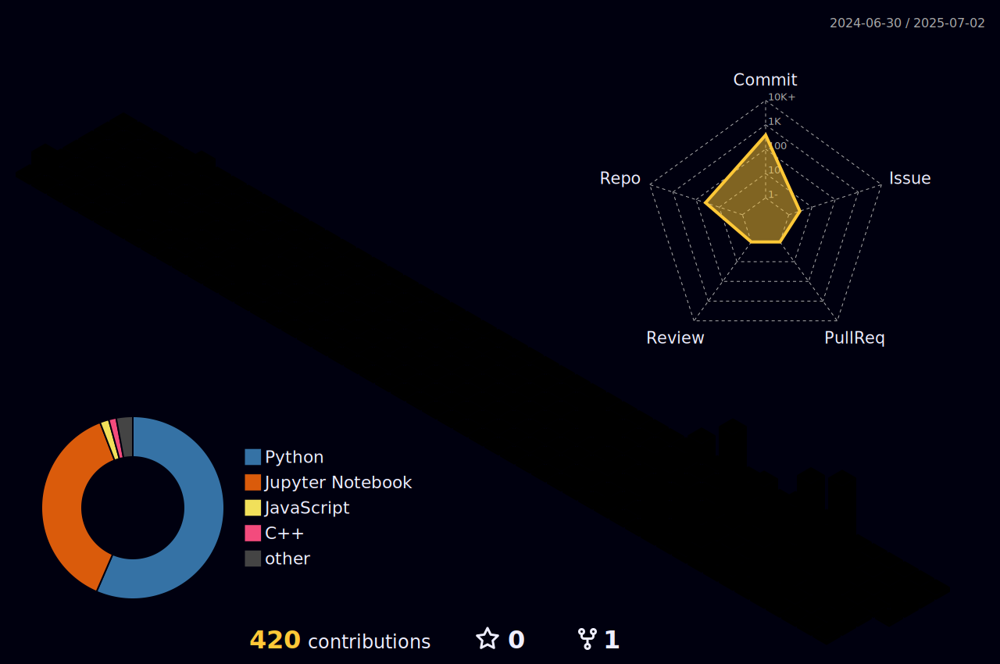

<!--
## Hi there 👋
-->

<h2> Hi! there</a>  </h2>

<!--
**IamRam3/IamRam3** is a ✨ _special_ ✨ repository because its `README.md` (this file) appears on your GitHub profile.

Here are some ideas to get you started:

- 🔭 I’m currently working on ...
- 🌱 I’m currently learning ...
- 👯 I’m looking to collaborate on ...
- 🤔 I’m looking for help with ...
- 💬 Ask me about ...
- 📫 How to reach me: ...
- 😄 Pronouns: ...
- ⚡ Fun fact: ...
-->

Hey, you! Yeah, you—caught you lurking on my page! 👀
I see the numbers climbing! 🧑‍💻 </br>
No pressure though—if you think I’m cool enough, don’t be shy... hit me up! 🔥 [](https://github.com/IamRam3)

<!--# <div align="center" style="font-size: 36px;">Hey 👋 I'm Ram Dhavileswarapu</div>-->

<h1 align="center"><b>Hey </b><b> I'm Ram Dhavileswarapu </b></h1>

<p align="center">
  <a href="mailto:sairam68386@gmail.com"></a>
  <a href="https://www.linkedin.com/in/ram-dhavileswarapu-4ab502250/"></a>
  <a href="https://ramdhavileswarapu.netlify.app/">
  
</a>
</p>

<div align="center">
  
</div>

## <picture></picture> <span style="font-size: 30px;">About ME </span> 


<!--<span style="font-size: 18px;">-->
I'm an **`engineer`** with a deep love for coding, math, and physics. I'm passionate about `crafting intelligent systems` that solve real-world problems. From autonomous robotics to scalable web apps & exploring reinforcement learning, or pushing performance limits in computer vision and HPC—I thrive on `solving complex problems that matter`. I thrive at the intersection of software and hardware, where the boundaries between the two start to blur. I'm a strong believer in `open source`, `continuous learning`, and using tech to create real-world impact. Let's collaborate, innovate, and bring ideas to life! 🤖⚡
<!--</span>-->


- 🌱 **Exploring:** , Robotics, Computer Vision (beyond just 2D), High Performance Computing, and AI
- 💼 **Open for:** AI/Robotics Engineering, Research-Driven Development, and Open Source Collaborations
- 💬 **Let's talk about:** AI, Autonomous Systems, System Design, AI Agents, Open Source Contributions, point clouds or any cutting-edge tech
- ♟️ **Hobbies:** Chess, Cricket, Long Runs, and diving into anything new and exciting in tech or life

__View my resume__ [here](https://github.com/IamRam3/side-projects/blob/main/resume/ram_cv.pdf).

<h2> Skills & Tools : </h2>

<p align="center"> 
<div align="left">
  <kbd> <kbd> DataBases </kbd> <br><br>
  
  
  
  
    </kbd>
  
  
  
  
  <kbd> <kbd> DataBases </kbd> <br><br>
  
  
  
  
  </kbd>
  
  
  
  
  
  
  
  
  
  
  
  
  <!-- Custom icons -->
  
  
  
  
  
  
  
  
  
  
  
  
  
</div>


<br>

<h2> 
  <!---->
  <!---->
   GitHub Stats:</h2>


<table> 
  <tr>
    <td></td>
    <td></td>
   </tr>
</table>
<table>
  <tr>
    <p align="center">
      
      
<!--        -->
     
    </p>
  </tr>
</table>


<details><summary>
<h2>    Development Breakdown: </h2></summary>

<!--START_SECTION:waka-->


<!--END_SECTION:waka-->
</details>
 
<table> 
  <tr>
    <p align="center"></p>
   </tr>
</table>
<table> 
   
</div>
</table>


<!--
## 📊 GitHub Activity Graph

<a href="https://github.com/IamRam3">
  
</a>
-->

<!--- trophy (start) -->
<div align=center>
  <a href="https://github.com/IamRam3/github-profile-trophy" title="Go to Source">
      
    </a>
</div>
<!--- trophy (start) -->

<br>
<br>

 ----------
 
[](https://github.com/OldCodersClub/faq)

[](https://github.com/IamRam3?tab=repositories&q=&type=&language=&sort=stargazers)


### 🧊 3D Contribution Graph



<p align="center">
    
  <h4 align="center"><code>📊 𝙶𝚒𝚝𝙷𝚞𝚋 𝙼𝚎𝚝𝚛𝚒𝚌𝚜</code></h4>
</p>

<code><a href = "https://www.adobe.com/in/products/illustrator.html"></a></code>

<hr>

<pre>

 I look forward to collaborate on impactful projects
</pre>
<hr>

<a href="https://www.linkedin.com/in/sanskar-jaiswal-102b661a3/">
  
</a>
<a href="https://www.instagram.com/j.sanskarr/">
  
</a>
<a href="https://twitter.com/TitanWithKagune">
  
</a>

 <a href="https://github.com/DenverCoder1/readme-typing-svg"></a>

```python
class Engineer(Ram):
   """self-taught developer that love to learn more about Technologies"""
   
   def __init__(self):
     
      self.name = "Ram"
      self.age = 24
      self.role = "Fresher"

      self.TOOLS = {
          "ScriptingLanguages" : ("Python"),
          "ProgrammingLanguages" : ("C++"),
          "Editors" : ("VsCode"),
          "Platform" : ("LINUX",),
          "OtherTools" : ()
         }

      self.INTERESTS = [
         "Computer Sciences",
         "Electrical & Electronic Engineering",
         ]

   def use(self, tool):
      """use one of my tools or use bunch of them."""
      return self.tools[tool]


   def work(self):
      """"""
      while not WORK_DONE:
         # keep work.
         self.use(tool)

      return WORK_DONE


   def __len__(self):
      """Fun Fact"""
      return 181 # cm


   def __repr__(self):
      """"""
      return f"{self.name} an {self.age} y.o self-taught developer and {self.role}"

```
<!-- to print thick horizontal line -->
---

<!--YEAR_PROGRESS_START-->
⏳ Year progress { ████████▁▁▁▁▁▁▁▁▁▁▁▁▁▁▁▁▁▁▁▁▁▁ } 28.67 % I still have time to learn more Techs this year
<!--YEAR_PROGRESS_END-->


-----------


